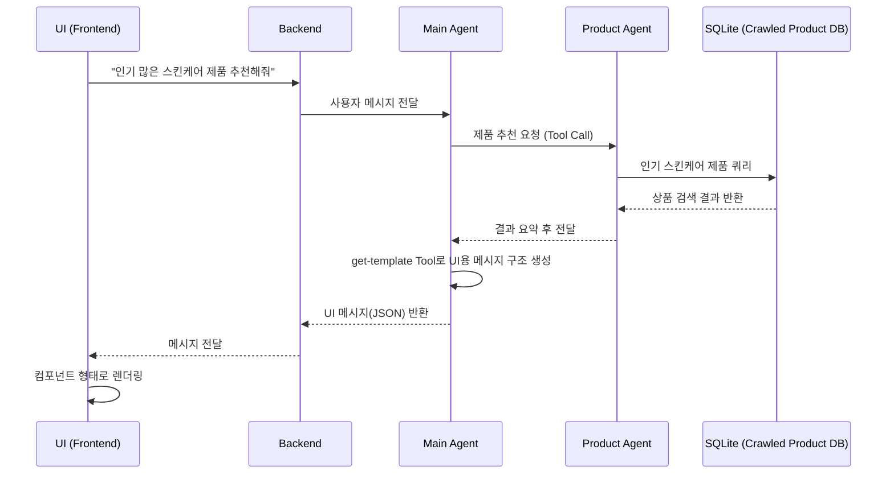

## AI 쇼핑 어시스턴트 플랫폼 (MVP) 요약

본 프로젝트는 **AI 기반 쇼핑 어시스턴트의 최소 기능 제품(MVP)** 구현을 목표로 하였습니다.
핵심 목적은 **대화 기반 제품 탐색 및 추천 경험**을 제공하는 것입니다.

---

### 강조하고 싶은 부분

이 프로젝트는 단순히 기술을 사용하는 것이 아니라, **AI 에이전트가 크롤링한 데이터, UI, 백엔드 전체 흐름에 자연스럽게 녹아드는 구조**를 고민하는 데 중점을 두었습니다.

특히 다음을 강조하고 싶습니다:

* 기술 스택보다 **AI 에이전트 사용을 고려한 UI/Backend 설계**에 집중했습니다.
* 단순히 채팅 영역을 덧붙인 것이 아니라 **UI의 모든 컴포넌트를 메시지로 표현**했습니다.
  이는 LLM의 요청 구조가 `messages[]` 형태로 이루어지는 것에서 착안한 것이며,
  이로 인해 AI agent가 **화면 구성 요소를 생성하고 관리할 수 있습니다**.

핵심 코드 디렉토리:
AI 에이전트: backend/src/agent
Web-crawler: web_crawler/core
크롤링한 데이터: web_crawler/output/products.csv

---

### 설계 의도

기존 UI 경험과 크게 동떨어지지 않으면서도, **에이전트가 화면 구성과 흐름을 통제할 수 있는 구조**를 목표로 하였습니다.

* 현재는 메시지가 그대로 누적되지만,
  **향후 cursor 코드 편집기처럼 에이전트가 UI 메시지 리스트 자체를 관리**하는 방향을 염두에 두었습니다.
* 백엔드·UI 코드는 MVP에 집중하기 위해 최대한 단순하게 구성했습니다.
  로그인 등은 제외하고, **데이터베이스는 SQLite를 사용해 최소 구현을 지향**했습니다.

에이전트는 **메인 에이전트 1개 + 서브 에이전트 1개**의 멀티 에이전트 구조로 구성했습니다.

* 멀티 에이전트 구조의 장점은 역할 분리뿐 아니라,
  **툴 호출 결과를 전체 프롬프트에 모두 누적하지 않고 서브 에이전트가 요약해 전달하는 구조**로 구성하여
  프롬프트 압축 효과와 유지보수성을 확보했습니다.

---

### 데이터 수집

데이터는 올리브영 **스킨케어 랭킹 TOP 100 제품을 수동 크롤링**하여 구축했습니다.

* 올리브영을 선정한 이유는 **필수 고시 정보 등 제품 메타데이터가 잘 정리되어 있었기 때문**입니다.
* Shadow DOM 구조로 인해 난이도가 있었으며, **HTML 구조를 분석한 뒤 DFS 방식으로 타겟 태그까지 탐색**하는 방식으로 접근했습니다.

---

### MVP 요약

* **기능:** 사용자와의 대화를 기반으로 **제품 검색 및 추천** 제공
* **AI:** 툴 호출 기반으로 **제품 정보와 리뷰를 탐색·분석**
* **UI:** 모바일 중심 **단일 페이지 메시지 기반 인터페이스**
* **제한사항:**
  * 로그인 미지원
  * Chat 테이블 미구현
    → **사용자의 AI 기반 제품 탐색 경험에 집중**
* **데이터:** 크롤링한 올리브영 스킨케어 TOP 100 제품 데이터 사용

---

### 💻 시스템 아키텍처

AI 쇼핑 어시스턴트는 다음 세 부분으로 구성됩니다:

1. **프론트엔드 (Frontend)**
   * **기술:** React
   * **특징:** 화면을 컴포넌트가 아닌 **메시지 단위로 구성**,
     에이전트가 **UI 요소를 직접 생성·관리할 수 있는 구조**

2. **백엔드 (Backend)**

   * **기술:** Node.js / Express.js
     에이전트 기술스택은 **LangChain.js + GPT-4o-mini** 입니다
   * **API:** socket.io 기반 실시간 대화 송수신

3. **데이터 저장소**
   * **SQLite 사용**, 최소 기능 구현에 중점

---

### AI 에이전트 구조

AI 기능은 **계층적 멀티 에이전트 구조**로 이루어져 있습니다.

* **메인 에이전트 (판매 에이전트):**
  사용자 대화를 통합적으로 관리하는 오케스트레이터
* **제품 에이전트:**
  SQLite를 통해 **제품 검색·조회·분석** 수행

최종 응답은 메인 에이전트가 상황에 맞게 **JSON 형태 메시지**로 반환합니다.

---

### 🤔 아쉬웠던 점

3일 동안 크롤링–프론트–백엔드를 병행하다 보니
부분적으로는 **안티패턴이 드러나는 코드도 있고 디테일에서 아쉬움**이 남습니다.

하지만 MVP 완성을 우선순위로 삼아,
**과감히 덜어낼 것은 덜어내고 제품 기능 전달에 집중**했습니다.

---

### 🔧 개선 가능 방향
* **AI 에이전트**
  Sub 에이전트를 추가해 다양한 일을 처리하게 할 수 있습니다.

* **응답 스트리밍 처리**
  현재는 메시지를 모두 생성한 뒤 한 번에 전달하고 있으나, 스트리밍 방식으로 응답을 전달하면 사용자 경험이 더욱 향상될 것으로 기대합니다.

* **크롤링 자동화 및 대용량 확장**
  현재는 수동 크롤링 기반이므로, 향후 자동화 및 대규모 데이터 수집까지 확장할 수 있는 구조로 개선할 수 있습니다.

* **메시지 큐 기반 비동기 에이전트 분리**
  LLM 요청은 처리 시간이 길어질 수 있기 때문에, 메시지 큐를 도입하면 안정적이고 확장성 있는 구조로 개선할 수 있습니다.

* **타입 정교화 (예: Zod 활용)**
  웹소켓 기반 메시지 유형이 다양해질수록 타입 검증이 중요해지므로, 타입 스키마를 도입하면 유지보수성과 신뢰도를 높일 수 있습니다.

* **데이터베이스**
  현재는 SQLite를 사용하고 있지만, mongoDB를 사용하여 데이터를 저장할 수 있습니다.

  
